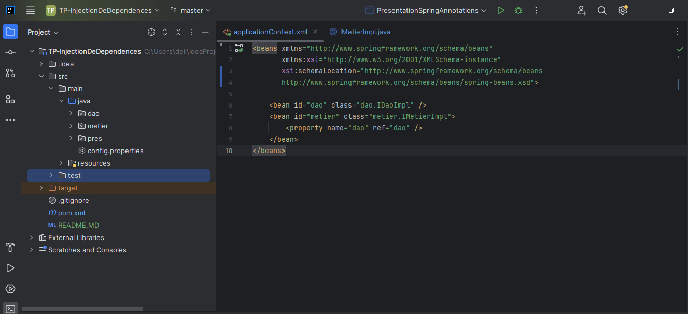
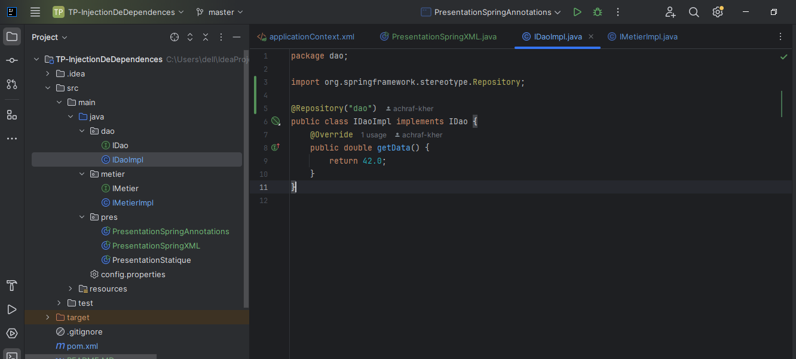
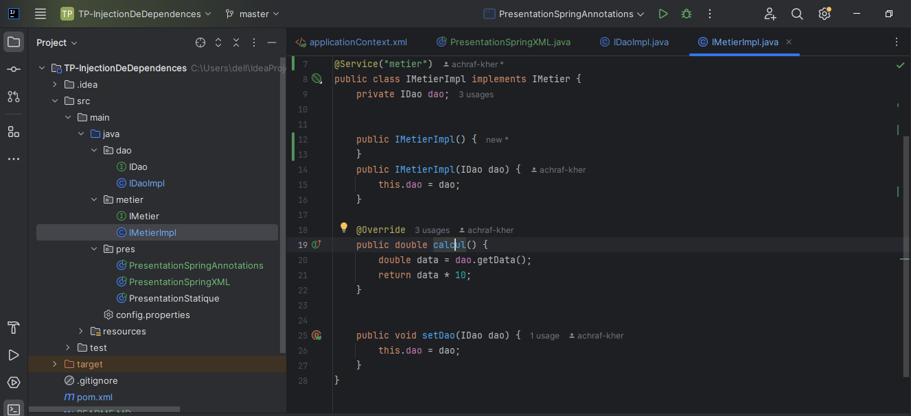
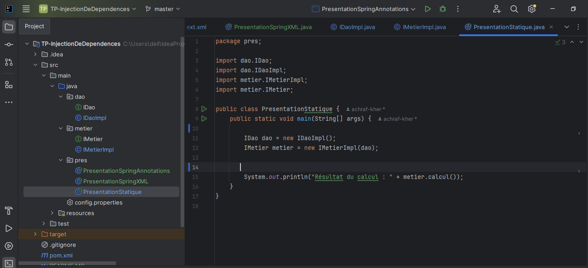
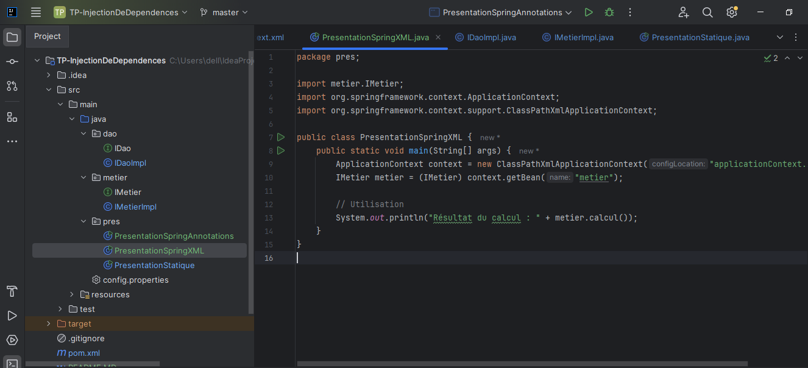

<h1>Injection des dépendances</h1>

<h5> implémentation d'une interface IDao avec une méthode getData</h5>

<h5> implémentation d'une interface IMetier en utilisant le couplage faible</h5>

<h5>Injection des dépendances par instanciation statique</h5>

<h5>Injection des dépendances En utilisant le Framework Spring Version XML</h5>

